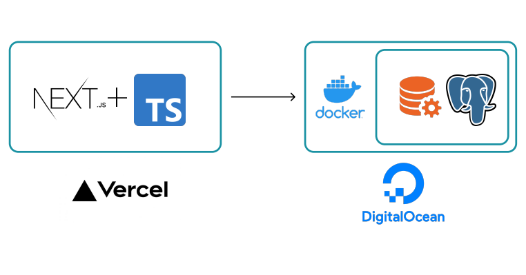

# Aplicación web desplegada
En el siguiente enlace se puede abrir la aplicación web ejecutándose: https://users-crud-cfrafppxr-alexangulomtz.vercel.app/

# Aplicación Gestor de Usuarios y Privilegios
Esta es una aplicación web a manera de CRUD para gestionar los usuarios y privilegios de un gestor de base de datos.

# Arquitectura
Web App: Aplicación web Full Stack con el framework Next.js + Typescript. Desplegada en Vercel. Base de datos: Instancia de PostgreSQL ejecutándose en un contenedor Docker dentro de una instancia Droplet de la plataforma Digital Ocean.

